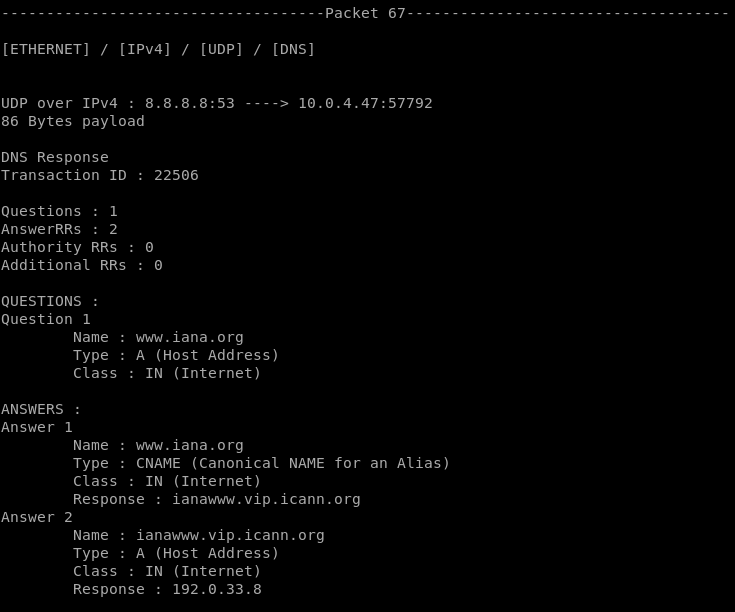
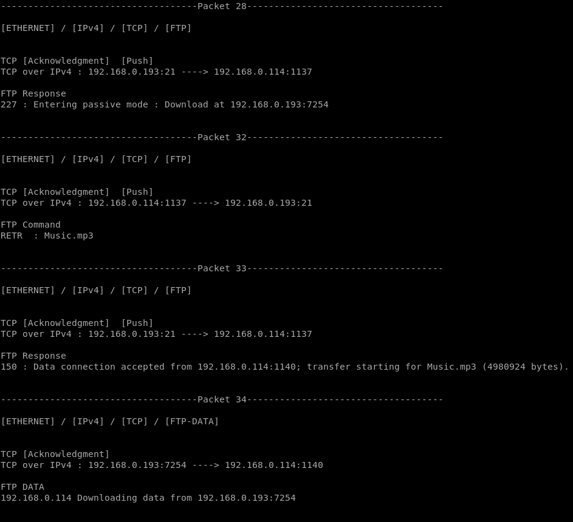
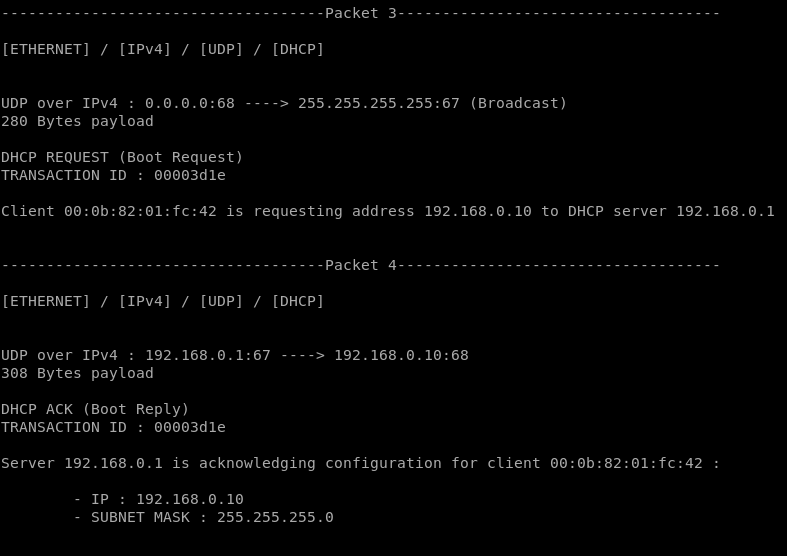
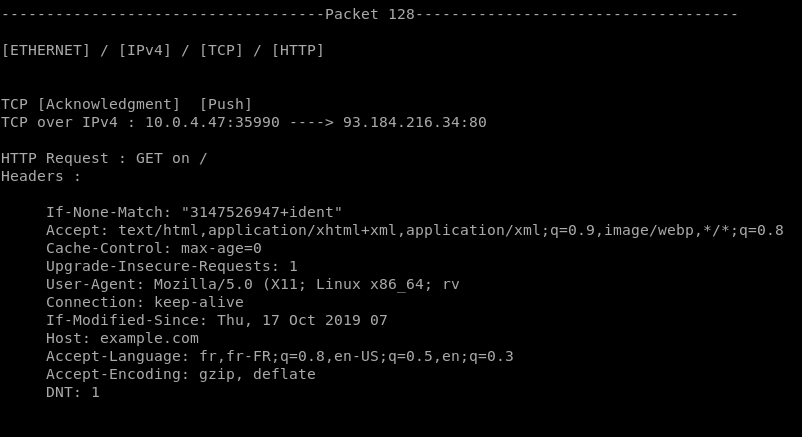

# Packet Analyzer
## Fonctionnement du programme
</br>
Le programme est architecturé autour de 3 classes principales :</br></br>

### <b>Packet.java</b>
</br>

Cette classe représente un paquet contenu dans le fichier pcap. Elle contient en attribut les métadonnées du paquet, ses données ainsi que des objets représentant les différents protocoles qui peuvent y être reconnus.</br>
Une méthode permet d'en récupérer les données :
```
Packet.summary() // Retourne un résumé des données pertinentes du paquet
```
L'affichage sera différent selon les protocoles qui ont pu y être reconnus. On retrouve néanmoins un résumé des protocoles reconnus en 1ère ligne.</br></br>

### <b>PcapReader.java</b>
</br>
Cette classe se construit avec un nom de fichier.</br>
Deux méthodes servent à récupérer les données depuis le fichier :

```
PcapReader.getFileHeaders() // Retourne une Hashtable contenant les headers du fichier au format Key/Value
```
```
PcapReader.getPacketList() // Retourne la liste d'objets Packets qui a pu être lue depuis le fichier
```
</br></br>

### <b>ProtocolParser.java</b>
</br>
Cette classe contient toutes les méthodes permettant de reconnaître des protocoles.</br> Pour chaque protocole PROTO , une méthode correspondante est définie comme suit : 

```
ProtocolParser.recognize<PROTO>() // Retourne un objet de type <PROTO> contenant les informations du protocole <PROTO> si il a été reconnu, sinon un objet vide <PROTO>
```
Cette classe statique contient également des fonctions utiles au traitement des paquets, notamment pour la gestion des flags et le traitement de l'hexadécimal du fichier.</br>
La reconnaissance des protocoles ainsi que la récupérations de leurs données quand ils sont reconnus se fait grâce à des expressions régulières.
</br></br>

### <b>PacketAnalyzer.java</b>
</br>
C'est la classe principale du programme.</br>
Le nom de fichier à traiter ainsi que le filtre demandé sont récupérés depuis les arguments du programme.</br>
La classe `PcapReader` est ensuite appelée pour récupérer une liste de paquets ainsi que les headers globaux depuis le fichier mentionné.</br>
On va ensuite traiter chacun des paquets récupérés pour définir ses procoles et gérer la fragmentation IPv4 si cela est nécessaire grâce à la fonction suivante :

```
PacketAnalyzer.parsePacketProtocols()
```
Cette fonction va analyser séquentiellement les données du paquet pour y reconnaître des protocoles et récupérer les informations de ces dits protocoles si ils sont reconnus.
L'architecture suivante a été mise en place :
<ul>
<li>Reconnaissance d'Ethernet, si reconnu : </li>
    <ul>
    <li>Reconnaissance d'ARP</li>
    <li>Reconnaissance d'IPv4, si reconnu : </li>
        <ul>
        <li>Reconnaissance d'ICMP</li>
        <li>Reconnaissance de TCP, si reconnu :</li>
            <ul>
            <li>Reconnaissance de HTTP</li>
            <li>Reconnaissance de FTP</li>
            <li>Reconnaissance de DNS sur le port 53</li>
            </ul>
        <li>Reconnaissance d'UDP, si reconnu :</li>
            <ul>
            <li>Reconnaissance de DHCP</li>
            <li>Reconnaissance de HTTP</li>
            <li>Reconnaissance de DNS sur le port 53</li>
            </ul>
        </ul>
    </ul>
</ul>
Pour chacun des protocoles traités, un objet du type du protocole est ajouté au paquet traité. Une fois qu'un protocole a été reconnu, les données traitées sont tronquées des données correspondant au protocole reconnu, pour ne passer que les informations utiles à la reconnaissance d'un nouveau protocole.</br>
Lorsque tous les paquets ont été traités, on réassemble les paquets IP fragmentés, puis on affiche les paquets en fonction du filtre demandé.</br>
Suite à l'affichage des paquets, un résumé est affiché, synthétisant le nombre de paquets reconnus pour les différents protocoles, ainsi qu'une liste des paquets qui ont été réassemblés.
</br></br>

## Protocoles traités
Etant donné que tous les traitements réalisées sont fait du des chaînes de caractères récupérés depuis le fichier, j'entends par "Caractère" hexadécimal 1 caractère de la chaîne de caractère traitée. En réalité, chaque octet du paquet est représenté par 2 caractères dans la chaîne de caractères traitée.
### Ethernet
</br>
La reconnaissance d'Ethernet se fait grâce à une expression régulière matchant :
<ul>
<li>[Capturé] Une suite de 12 caractères hexadécimaux (MAC destination)</li>
<li>[Capturé] Une suite de 12 caractères hexadécimaux (MAC source)</li>
<li>[Capturé] [Optionnel] Les caractères "8100" suivis de 4 caractères hexadécimaux (Header pouvant être présent sur un réseau comportan des VLAN taggés selon la norme IEEE 802.1Q)</li>
<li>[Capturé] Une suite de 4 caractères hexadécimaux (Ether Type)</li>
</ul>
Ces quatres champs sont capturés grâce à l'expression régulière et stockés dans l'objet Ethernet.</br>
Etant donné que le programme quitte si le fichier concerne une capture sur un réseau fonctionnant sur un protocole autre que Ethernet (ce test est réalisé grâce aux headers globaux du fichier), il n'y a pas de vérification supplémentaire sur la nature du paquet (De plus, l'adresse mac ne peut être que difficilement reconnue d'autres valeurs hexadécimales).
</br>
Seulement les informations utiles pour comprendre le paquet ont été gardées : l'adresse MAC source et destination.
</br>
Exemple de paquet contenant seulement de l'Ethernet :
</br></br>

</br></br>


### ARP
</br>
La reconnaissance de l'ARP se fait grâce à une expression régulière récupérant certaines informations :
<ul>
<li>Hardware Type (l'expression régulière est construite dynamiquement avec le Hardware Type présent dans les headers globaux du fichier traité)</li>
<li>[Capturé] Protocol Type : Soit 0800 (IPv4) soit 86dd (IPv6), étant donné que ces 2 protocoles étaient potentiellement à traiter</li>
<li>Harware Size : Construit dynamiquement grâce à la Network Length récupérée depuis les headers globaux (Network Length) du fichier traité</li>
<li>[Capturé] Protocol Size : soit 04 (IPv4) soit 10 (IPv6)</li>
<li>[Capturé] Opcode : soit 0001 (Requête) soit 0002 (Réponse) pour l'ARP simple</li>
<li>[Capturé] Sender MAC address : Suite de 12 caractères hexadécimaux</li>
<li>[Capturé] Sender IP address : Suite de 8 caractères hexadécimaux</li>
<li>[Capturé] Target MAC address : Suite de 12 caractères hexadécimaux</li>
<li>[Capturé] Target IP address : Suite de 8 caractères hexadécimaux</li>
</ul>
L'utilisation de valeurs fixes dans l'expression régulière permet d'être assuré de bien matcher de l'ARP, même si c'est au détriment dans certains cas d'une gestion de plus de cas exotiques. Néanmoins, j'ai décidé ici de seulement reconnaître de l'ARP sur IPv4 et IPv6. Le faible nombre de Opcode permet aussi d'avoir une bonne confiance en la reconnaissance de ce protocole</br>
Ces données ont été mises en forme pour l'affichage afin de faciliter la compréhension du paquet, dans un style proche de celui de Wireshark, que j'ai trouvé clair et bien réalisé :
</br></br>

</br></br>

### IPv4
</br>
La reconnaissance de l'IPv4 se fait grâce à une expression régulière récupérant certaines informations :
<ul>
<li>IP Version : 4 pour IPv4</li>
<li>[Capturé] Header Length : Un caractère hexadécimal</li>
<li>[Capturé] Diffentiated Services Field : 2 caractères hexadécimaux</li>
<li>[Capturé] Total Length : 4 caractères hexadécimaux</li>
<li>[Capturé] Identification : 4 caractères hexadécimaux</li>
<li>[Capturé] Flags et Fragment Offset : 4 caractères hexadécimaux</li>
<li>[Capturé] TTL : 2 caractères hexadécimaux</li>
<li>[Capturé] Protocole : 2 caractères hexadécimaux</li>
<li>[Capturé] Header checksum : 4 caractères hexadécimaux</li>
<li>[Capturé] IP Source : 8 caractères hexadécimaux</li>
<li>[Capturé] IP Destination : 8 caractères hexadécimaux</li>
<li>[Capturé] Options : Entre 0 et 40 caractères hexadécimaux (Etant donné qu'il n'y a pas de taille limite pour les options, j'ai décidé d'utiliser la valeur maximale de 40, car les options sont plus courtes sur tous les exemples d'options que j'ai pu voir. Cela ne pose pas de problème à la décapsulation car cette dernière se fait en utilisant le champ "Header Length") (La gestion de ces options n'est que partielle par manque de temps)</li>
</ul>
Etant donné que le protocole Ethernet nous spécifie le protocole utilisé sur la couche 3 via son champ Ether Type, il n'y a pas besoin de beaucoup de vérifications concernant la reconnaissance de l'IPv4.</br>
De ces informations, seules les adresses IP source et destination sont gardées pour l'affichage. Leur affichage est différent selon les protocoles de la couche supérieure.
</br></br>

### ICMP
</br>
La reconnaissance de l'ICMP se fait grâce à une expression régulière récupérant certaines informations :
<ul>
<li>[Capturé] Type : 2 caractères hexadécimaux</li>
<li>[Capturé] Code : 2 caractères hexadécimaux</li>
<li>[Capturé] Checksum : 4 caractères hexadécimaux</li>
</ul>
Un axe d'amélioration est d'utiliser les champs d'identification et de séquence pour lier une requête à sa réponse.</br>
Tous les Types et Codes ICMP sont parsés dans la classe `Icmp` afin d'afficher leur nom.</br>
Etant donné que le protocole Ethernet nous spécifie le protocole utilisé sur la couche 3 via son champ Ether Type, il n'y a pas besoin de beaucoup de vérifications concernant la reconnaissance de l'ICMP</br>
Exemple d'affichage de paquet ICMP (Type et Code, addresses IP, MAC ainsi que la taille du payload, qui peut être utile pour repérer une extraction de données : afficher l'entièreté du payload alourdirait beaucoup l'affichage):
</br></br>

</br></br>

### TCP
</br>
La reconnaissance du TCP se fait grâce à une expression régulière récupérant certaines informations :
<ul>
<li>[Capturé] Port Source : 4 caractères hexadécimaux</li>
<li>[Capturé] Port Destination : 4 caractères hexadécimaux</li>
<li>[Capturé] Numéro de séquence : 8 caractères hexadécimaux</li>
<li>[Capturé] Numéro d'acquittement : 8 caractères hexadécimaux</li>
<li>Header Length : 1 caractère hexadécimal (Pas capturé car récupéré avant pour faciliter le bon traitement du paquet)</li>
<li>Début des Flags : 0 (les 4 bits de poids faible du 1er octet partageant le header lengt et les flags TCP sont réservés selon la RFC 793, donc toujours à 0)</li>
<li>[Capturé] Flags : 2 caractères hexadécimaux</li>
<li>[Capturé] Windows size : 4 caractères hexadécimaux</li>
<li>[Capturé] Checksum : 4 caractères hexadécimaux</li>
<li>[Capturé] Urgent Pointer : 4 caractères hexadécimaux</li>
<li>[Capturé] Options : entre 0 et 40 caractères hexadécimaux (pour les mêmes raisons que le protocole IPv4)</li>
</ul>
Seulement les informations Source Port, Destinaton Port ainsi que les flags sont considérées comme pertinents à afficher pour comprendre le paquet. L'affichage est combiné avec les informations du protocole IPv4 afin de rendre les informations plus visuelles.</br>
Etant donné que le protocole IP spécifie le protocole de couche supérieure utilisée, il n'est pas nécessaire d'ajouter plus que ce qu'il n'y a déjà de valeurs fixes (le début des flags) dans l'expression régulière afin d'augmenter la certitude de reconnaissance.</br>
Voici un exemple d'affichage de paquet TCP :
</br></br>

</br></br>

### UDP
</br>
La reconnaissance d'UDP se fait grâce à une expression régulière récupérant certaines informations :
<ul>
<li>[Capturé] Source Port : 4 caractères hexadécimaux</li>
<li>[Capturé] Destination Port : 4 caractères hexadécimaux</li>
<li>[Capturé] Length : 4 caractères hexadécimaux</li>
<li>[Capturé] Checksum : 4 caractères hexadécimaux</li>
</ul>
Etant donné que le protocole IP spécifie le protocole de couche supérieure utilisée, il n'est pas nécessaire d'implémenter plus de reconnaissance dans ce protocole.</br>
Similairement à TCP, l'affichage est combiné aux informations IPv4 pour apporter plus de visibilité. La taille du payload est également fournie, pour avoir une idée de la quantité d'informations transmises.</br>
Voici un exemple d'affichage d'UDP :
</br></br>

</br></br>

### DNS
</br>
La reconnaissance du DNS se réalise en deux étapes. Une première expression régulière est chargée de reconnaître le protocole, la seconde de récupérer les informations relatives au DNS lorsque qu'il a été reconnu.</br>
La première expression régulière va passer 24 caractères hexadécimaux des données applicatives (payload TCP ou UDP). Ces 24 caractères correspondent à la partie fixe du header DNS (Transaction ID, Flags, Questions, Answers RRs, Authority RRs, Additional RRs). L'expression régulière va ensuite récupérer les 2 caractères hexadécimaux suivants (qui correspondent à la taille en octets du 1er "mot" de la 1ère question du paquet) puis un "mot", composé uniquement de valeurs hexadécimales codant les valeurs autorisées dans un nom de domaine (lettres minuscules et majuscules, tiret "-") conformément à la RFC 1035.</br>
Une vérification est ensuite faite, pour être sûr que le mot récupéré est bien de la taille récupérée, conformément à la RFC 1035. Etant donné que plusieurs protocoles partagent un format de paquet extrêmement similaire (notamment MDNS), un filtre est rajouté sur le port 53 pour être convaincu que le protocole est bien du DNS.</br>
Une fois cette vérification faite, on applique une 2e expression régulière pour récupérer les headers : 
<ul>
<li>[Capturé] Transaction ID : 4 caractères hexadécimaux</li>
<li>[Capturé] Flags : 4 caractères hexadécimaux</li>
<li>[Capturé] Questions : 4 caractères hexadécimaux</li>
<li>[Capturé] Answers RRs : 4 caractères hexadécimaux</li>
<li>[Capturé] Authority RRs : 4 caractères hexadécimaux</li>
<li>[Capturé] Additionnal RRs : 4 caractères hexadécimaux</li>
</ul>
Une fois ces headers récupérés, on va utiliser les compteurs fournis pour boucler et récupérer autant de questions et de réponses qu'il y en a d'annoncées. Cette récupération gère la compression définie dans la RFC 1035.<br>
Les types de requêtes traitées sont A, AAAA, CNAME, MX, NS.</br>
Voici un exemple d'affichage de paquet DNS :
</br></br>

</br></br>

### FTP
</br>
Pour reconnaître le FTP, 2 expressions régulières sont construites afin de reconnaître les 2 types de message FTP : les commandes et les réponses. Pour cela, l'hexadécimal est converti en ASCII.</br>
Pour reconnaître les commandes, une expession régulière est construite grâce à l'énumération `FtpCommands` pour pouvoir matcher toutes les commandes ainsi qu'un argument optionnel, défini par des caractères ASCII affichables, suivis de "\r\n" pour terminer le message. Ces informations ont été récupérées depuis la RFC 959. Elle est construite comme suit : 
<ul>
<li>[Capturé] Commande : Une des commandes définies dans la RFC 959</li>
<li>[Capturé] [Optionnel] Argument : Une suite de caractères ASCII affichables</li>
<li>"\r\n" : Descripteur de fin de message</li>
</ul>
L'expression régulière pour reconnaître les réponses a une construction similaire. L'entièreté des codes de réponse sont récupérés dans l'énumération `FtpResponseCodes`. De la même manière que pour les commandes, on récupère également l'argument sous la forme d'une suite de caractères affichables ASCII suivis de "\r\n". Sa construction est la suivante : 
<ul>
<li>[Capturé] Response Code : Un des codes de réponse spécifié dans la RFC 959</li>
<li>[Capturé] Argument : Une suite de caractères ASCII affichables</li>
<li>"\r\n" : Descripteur de fin de message</li>
</ul>
Si on détecte la commande PASV, c'est à dire une demande au serveur de basculer en mode passif, on note les informations transmises par le serveur : IP du mode passif et port d'écoute. Ces informations serviront à reconnaître le protocole FTP-DATA.</br>
Exemple d'échange FTP :
</br></br>

</br></br>

### DHCP
</br>
Pour reconnaître et capturer le protocole DHCP, une expression régulière est utilisée. Plusieurs valeurs fixes sont utilisées avec de le repérer avec certitude. Voici la construction de l'expression régulière : 
<ul>
<li>Premier caractère hexadécimal du message Type : Toujours 0, car seulement 2 Message type sont spécifiés dans la RFC 2131 : 01 et 02</li>
<li>[Capturé] Deuxième caractère hexadécimal du message Type : Soit 1 soit 2</li>
<li>Harware Type : 01 pour Ethernet dans notre cas</li>
<li>[Capturé] Harware Address length : 2 caractères hexadécimaux</li>
<li>[Capturé] Hops : 2 caractères hexadécimaux</li>
<li>[Capturé] Transaction ID : 8 caractères hexadécimaux</li>
<li>[Capturé] Second elapsed : 4 caractères hexadécimaux</li>
<li>[Capturé] BootP flags : 4 caractères hexadécimaux</li>
<li>[Capturé] Client IP address : 8 caractères hexadécimaux</li>
<li>[Capturé] Your Client IP address : 8 caractères hexadécimaux</li>
<li>[Capturé] Next server IP address : 8 caractères hexadécimaux</li>
<li>[Capturé] Relay agent IP address : 8 caractères hexadécimaux</li>
<li>[Capturé] Client MAC address + padding: 32 caractères hexadécimaux</li>
<li>[Capturé] Server host name: 128 caractères hexadécimaux</li>
<li>[Capturé] Boot file name: 256 caractères hexadécimaux</li>
<li>DHCP Magic Cookie : Valeur fixe, donnée dans la RFC 2131</li>
<li>[Capturé] Options : Suite de caractères hexadécimaux de taille variable</li>
</ul>
Le DHCP magic cookie permet d'identifier avec une quasi certitude ce protocole. Pour totalement écarter le risque de coïncidence, d'autres valeurs fixes sont ajoutées dans l'expression régulière (1er caractère hexadécimal du Message Type et Hardware Type)</br>
Les options sont récupérées et ajoutées dans une Hashtable. Etant donné leur nombre, elles ne sont pas toutes bien formattées pour l'affichage. Seules les plus courantes sont affichées. Un affichage conditionnel est réalisé en fonction des différents options présentes.</br>
Seules les informations importantes pour la compréhension du paquet sont affichées. Voici un exemple d'échange DHCP :
</br></br>

</br></br>

### HTTP
</br>
Pour reconnaître le protocole HTTP, on essaye de reconnaître séparément les requêtes des réponses.</br>
Pour les requêtes, sur la chaine hexadécimale convertie en ASCII, on essaye d'abord de matcher les versions 0.9 et 1.0 d'HTTP :
<ul>
<li>[Capturé] Une des méthodes spécifiée dans la RFC 1945</li>
<li>[Capturé] Une URL ou une URI</li>
<li>Les mots "HTTP/0.9" ou "HTTP/1.0"</li>
</ul>
Si l'expression régulière n'es pas matchée, on essaye de reconnaître le protocole HTTP 1.1. L'expression régulière est la même, sauf qu'on ajoute la présence du header "Host", qui est obligatoire en HTTP/1.1 selon la RFC 2616. Une fois reconnu, toutes les données sont traitées pour séparer les headers des données quand elles sont présentes</br>
Pour reconnaître les réponses HTTP, on reconnaît :
<ul>
<li>Les mots "HTTP/" suivis de la version</li>
<li>[Capturé]3 chiffres représentant le code de réponse</li>
<li>[Capturé]Des caractères affichables ASCII représentant la raison</li>
<li>Les caractères "\r\n"</li>
</ul>
Le reste des données est ensuite traité pour récupérer les headers et les données, qui sont stockés dans des objets propres.
Voici un exemple de requête HTTP :
</br></br>

</br></br>

### Gestion de la fragmentation IP
</br>
La fragmentation IP est gérée de la manière suivante : on regarde si deux paquets ont le même ID, et si c'est le cas, on regarde si ils ont le même timestamp. Si c'est le cas, on considère que ces deux paquets sont bien fragmentés et font partie du même paquet. Le traitement par le timestamp a été rajouté pour pallier au cas où deux paquets avaient le même ID par pure coïncidence. Etant donné que les paquets sont envoyés à la suite, les timestamp sont toujours égaux pour 2 fragments dans les captures en ma possession.</br>
Une fois réassemblé, le paquet final est affiché à la suite des paquets fragmentés.</br></br>


## Utilisation du programme
</br>
Depuis le répertoire PacketAnalyzer :</br>

```
clear && javac src/*.java && java src/PacketAnalyzer captures/<file>.pcap <proto>
```
Où \<file> est le fichier à analyser et \<proto> le protocole à filtrer. \<proto> peut prendre les valeurs suivantes : 
<ul>
<li>eth</li>
<li>arp</li>
<li>ip</li>
<li>tcp</li>
<li>udp</li>
<li>icmp</li>
<li>dhcp</li>
<li>ftp</li>
<li>dns</li>
<li>http</li>
</ul>
Si aucun filtre n'est donné, aucun filtre ne sera appliqué et tous les paquets seront affichés.

## Fichiers Pcap

dns_cap.pcap : fragmentation, DNS, DHCP</br>
ftp.pcap : FTP</br>
dhcp.pcap, dhcp_renew.pcap : DHCP</br>
tcp.pcap : TCP, DNS, HTTP, ARP</br>
arp.pcap : ARP
icmp_tcp_udp.pcap : ICMP</br>
Tous : Ethernet, IPv4